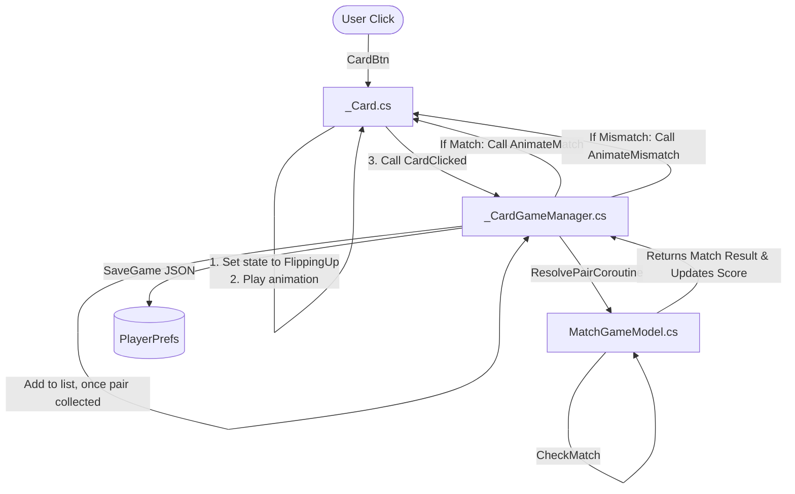

# Architecture & Data Flow

This document details the high-level code structure and data flow of the memory card game.

## Overview & Structure

The codebase is split into three main parts:
1. **Core Model (`MatchGameModel.cs`)**: Pure C# class holding game numbers, scoring rules, deterministic seeded shuffling, and matched card records. Has zero dependencies on Unity Engine.
2. **Game Manager (`_CardGameManager.cs`)**: Coordinates instantiation, game loop, dynamic UI creation, UI updates, and loading/saving serialization.
3. **Card Component (`_Card.cs`)**: Individual card behaviors, state machine management, and animation coroutines (flips, fades, scale pops).

---

## Data Flow Diagram

---

## Key Trade-Offs & Future Enhancements

### Trade-off: JSON Serialization to PlayerPrefs vs Application.persistentDataPath
- **Choice**: Saved the game data using `PlayerPrefs` with `JsonUtility.ToJson()`.
- **Reason**: `PlayerPrefs` is highly compatible across desktop and Android, requiring zero file permissions or platform-specific directory routing.
- **Future Enhancement**: If the card layout grows extremely large or requires rich metadata, we would transition to binary formatting stored in `Application.persistentDataPath` to optimize save file size and load speed.
